# Local Guides Point Calculator

---

# Intro
This project was created in my 7th month of coding, using React, Javascript, and CSS. It also utilizes the Material UI (MUI) library.
This project allows Google Maps Local Guide volunteer users to devise a plan to reach their desired goal points. I was inspired by the community’s passion and drive to achieve points as they contribute to crowdsourcing content on Google Maps. 
Further, I had a lightbulb moment when after bootcamp, we were instructed to self-study data structures and algorithms. A month and half in, I realized how Leetcode is akin to creating a mathematical formula to solve a problem. In this case, the formula would be how to calculate the number of contributions needed to reach a goal. Currently, there exists no way, and so I thought of how we can both smart-calculate based on user current behavior and manual-calculate based on user selection. I then built a UI tool around it that users can use. You can try out this tool at: https://local-guides-calculator.netlify.app/. 


---

# Table of Contents

1. **Overview**
   - Calculations
   - Design
     - User Flow
     - Navigation Header
2. **Installation**
3. **Input Page**
   - Uncontrolled Component 
   - Local Storage
     - Storing User Data
     - Retrieving User Data
4. **Utils**
   - General Utils
     - calculationUtils
   - Data Utils
     - categoryPointsMap
     - frequencyMarks
   - SmartCalculate Utils
     - smartDivide
     - smartPercentage
   - Validate Utils
     - validateHome
     - validateSmartInputs
     - validateManualInputs
5. **Error Handling**
   - Validation Functions
   - Error Management/ Feedback
   - Input Handling
   - Invalid Submissions
   - Invalid Table
6. **What I Learned**
   - Reference Equality
   - Infinite Re-renders
   - Dependency Array
     - Page Refreshes
   - _redirects
7. **Looking Ahead**

---

# Overview

## Calculations
The app can perform two types of calculations to help users devise a plan to reach their goal:

- **Smart-calculate**: User’s current % of contributions distribution (retrieved from number of contributions per category/ total number of contributions) is used to generate a weighted plan. This plan aligns with the user’s current contribution activity trends. The difference to goal is multiplied by the %, and the date/frequency is taken into account to get the user plan.

- **Manual-calculate**: User would select which categories you want to contribute to. Each selected category is then given an equal % weight, and the difference to goal is multiplied by those equal %, and the date/frequency is taken into account to get the user plan.

**Note**: 

- **Percentages**: I’m calculating % by total contributions vs points to be more equitably accurate (as points can incorrectly skew distributions- say if a category earns more points).

- **Effective Frequency**: I had to tweak the `calculateNumberPerDay`, by using "effective frequency" to more accurately derive a plan. 

`let effectiveFrequency = (frequency / 7) * daysInBetween;`

This works by seeing the days from today to the user's selected date. Then, from there, it is divided by 7 to get the number of weeks left. Next, it is multiplied by the frequency to get the effective frequency- or the actual number of days the user will be contributing.

For example, if we have 14 days left (2 weeks) and we have to contribute 3 times a week, we have to contribute 6 times in total- so 6 would be our "effective frequency".

```
for (let [key, value] of numberPerContributionMap) {
    let newValuePerDateFrequency = 0;
    if (daysInBetween === 0) {
        newValuePerDateFrequency = value;
    }
    else if (daysInBetween <= frequency) { // handle edge case of one week or less
        newValuePerDateFrequency = Math.round(totalContributionsNeeded / daysInBetween);
    }
    else {
        let effectiveFrequency = (frequency / 7) * daysInBetween;
        newValuePerDateFrequency = Math.round(value / effectiveFrequency);
    }
```


## Design

### User Flow
The welcome page presents the user with an overview of what the calculator can do, as well as high-level instructions. For visual learners, an embedded demo [video](https://www.youtube.com/watch?v=8HG23q-J09o) can be played. This page ensures that the user is comfortably onboarded before proceeding. 

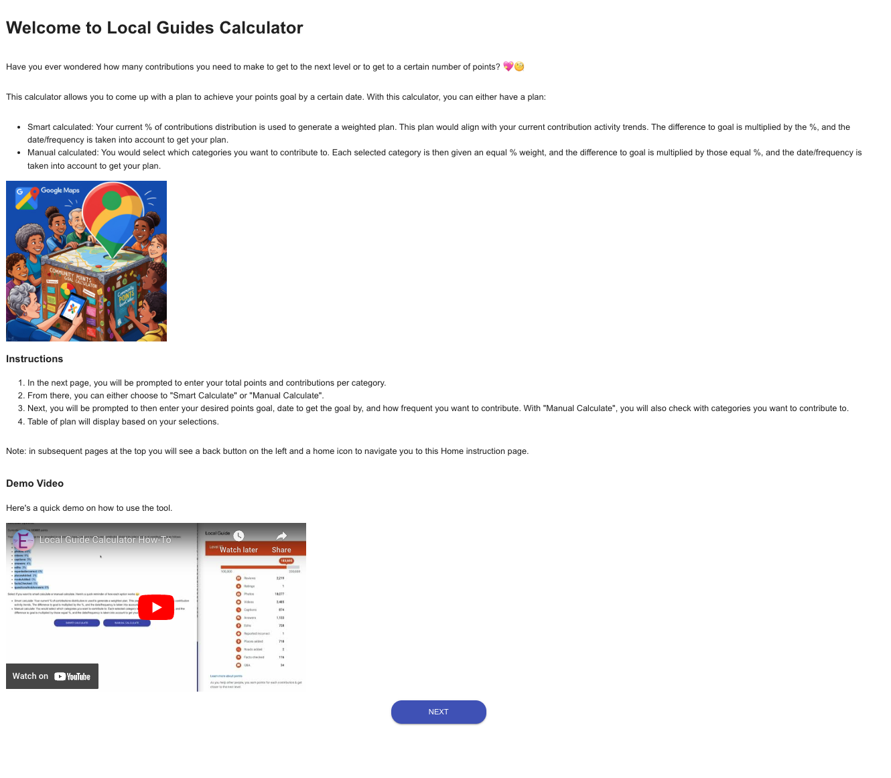

The user can then click `Next` to proceed to the `Input Form`. 
At the top of that page are instructions on how to access their contribution data on the mobile or desktop version of their Google Maps Local Guide profile. 
Short steps are provided below with how to fill out the form. As points are required, that is indicated with an asterisk. Underneath that are the input boxes for the other contribution categories. Beneath each input box is helper text, which tells the user what to input. 

Since the `formData` is a copy of `userData` and `userData` has the values default to 0, this means that the user can leave values blank for categories that they did not contribute to. Once the input form is done, the user can click `submit` and a confirmation of what they entered appears below. The user can then click `Next`.

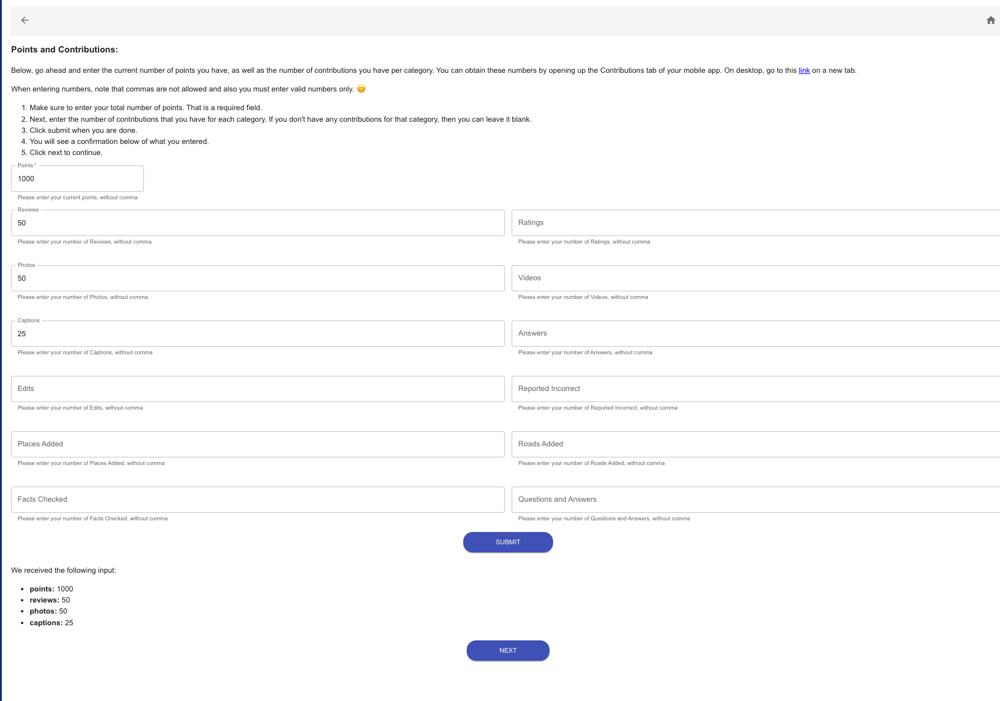

The next screen is the `Calculate Options` page. 
This page firstly shows the total number of points a user has. It also shows the percentage breakdown by category (number of contributions in a category divided by total number of contributions). This % is calculated from what the user input in the prior page. At the bottom of the page, users can select whether they want to `Smart Calculate` or `Manual Calculate` (and a description is provided of what each option does).

Both the `Smart Calculate` and `Manual Calculate` page allow the user to select: desired goal points, desired date to reach goal by, and how often a user wants to contribute per week. 

- `Smart Calculate` uses those 3 fields along with the user’s current contribution percentages to render a table. The table shows the users’ current percentage contributions. The next column shows the number of contributions needed per category. The third column shows how many contributions per day are needed, at the frequency per week that the user selected to achieve the user-selected goal points by goal date.

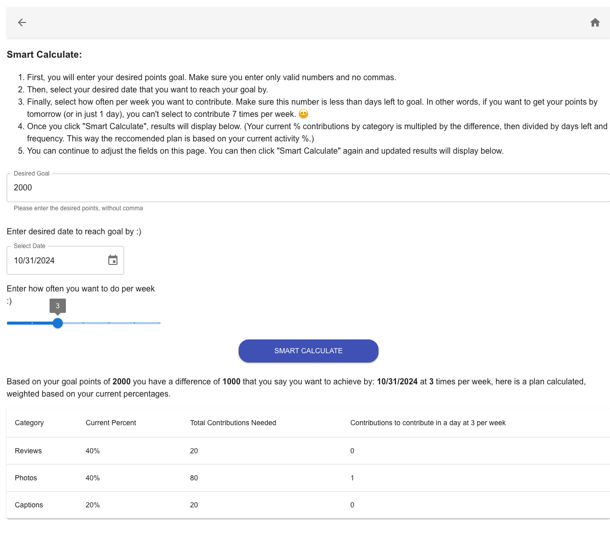

- `Manual Calculate` not only takes those 3 fields, but it also has a checkbox that users can check which categories they want to contribute to- allowing them more flexibility in building a plan. The contribution % would be equally distributed by how many categories are checked, i.e. if 5 categories are checked (= 100/5), the % per category allocated would be 20%. This % is what is shown in the first column of the result table. The second and third column respectively will show the same value types as mentioned in the `Smart Calculate` bullet point mentioned above. 

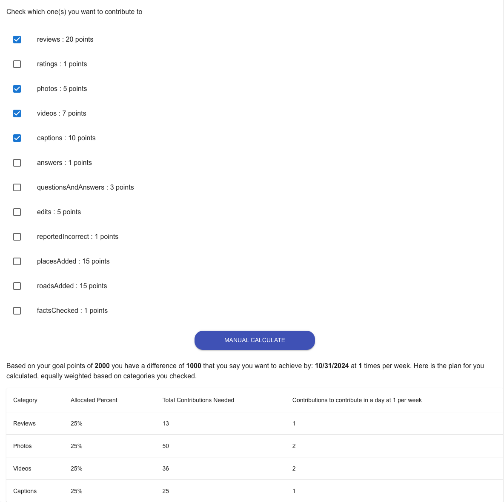

### Navigation Header
The navigation header has back and home buttons.  This enhances the user experience by allowing users to easily return to previous screens or go back to the home page.

The back button is implemented using the `useNavigate` hook from `react-router-dom`. When the user clicks the back button, the application calls the `navigate(-1)` function. This function instructs the router to go back one step in the navigation history, or in the other words to the previous page.

The `home` button is also implemented using the useNavigate hook. When clicked, it navigates the user directly to the home page (e.g., /home). This allows users to quickly return to the main input form or instructions without having to go through multiple pages.

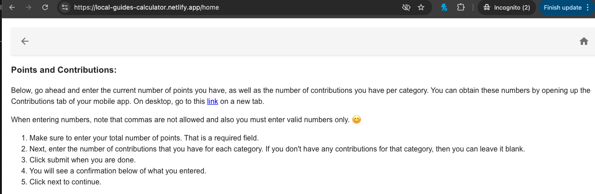

On `App.jsx`, the use of ` {location.pathname !== '/' && <Header />}` ensure we render that navigational header only if not on the Welcome page.

## Installation
When cloning the project for use, make sure to run npm install to install the required React dependencies on your local machine. Additionally, since the app uses React Router, React Icons, and Material UI, you will need to run the following commands:

```
npm install react-icons --save
npm install react-router-dom
npm install @mui/material @emotion/react @emotion/styled
```

--- 

# Input Page

The `HomeInput` component initializes a form with prepopulated values from `userData`, allowing users to view and edit their points and number of contributions. 

By using the spread operator (...), a shallow copy of `userData` is created with the line `const [formData, setFormData] = useState({ ...userData })`, which enables the form to display current values of `userData` while allowing modifications. Otherwise, if we just have the form values set to the original `userData` and not the copy, the fields are un-editable. 

Upon form submission, the original `userData` is updated with the values entered in `formData`, ensuring that user changes are reflected in the state: `setUserData(formData);`

## Uncontrolled Component 

To resolve the uncontrolled component issue I ran into, we give `formData.points` a default fallback value. The `TextField` component here is handling an input field that could otherwise become an uncontrolled component if its value is not properly managed. 

In other words, the `TextField` uses `value` to explicitly set its content, based on `formData.points`. If `formData.points` is undefined or null, it defaults to an empty string (""), ensuring that the input field always has a value. This prevents the component from becoming uncontrolled. (An uncontrolled component is an input element where the component itself doesn’t control its own state.)

```
<TextField
        label="Points"
        name="points"
        value={
          formData.points !== undefined && formData.points !== null
            ? formData.points
            : ""
        } // to resolve the uncontrolled component by giving formData.points a default value
```

## Local Storage

Local storage is used to persist data across page refreshes or sessions. I added this in when I noticed how if a page was refreshed, or if a user went back to a page to modify input- prior input was gone. I wanted to ensure seamless user input and experience.


Here’s how it’s used:

### Storing User Data

User data is saved to local storage whenever the user submits their input on points and number of contributions. You can see this in the `onSubmit` function of the `HomeInput` component:

``` 
localStorage.setItem("userData", JSON.stringify(formData));
```

The `localStorage` API in JavaScript can only store data as strings. This means if we want to save an object (like `formData`), we need to convert it to a string format first. `JSON.stringify` takes a JavaScript object and converts it into a JSON string representation.

### Retrieving User Data

Upon loading or refreshing the application, user data is retrieved from local storage and set in the context (and you can see more details in [Page Refreshes](#page-refreshes). This is handled using the useEffect hook in components like `Home`, `SmartCalc`, and `ManualCalc`.

In the useEffect hook within `SmartCalc`, the component retrieves the user data from local storage when the component mounts (or when the component is refreshed). If the data exists, it parses the JSON string and updates the context state using setUserData.

```
useEffect(() => {
    const storedUserData = localStorage.getItem("userData");
    if (storedUserData) {
        setUserData(JSON.parse(storedUserData));
    }
}, [setUserData]);
```
**Note**: ContextAPI is used in sync with local storage. While local storage allows you to persist data, the Context API ensures that the app can dynamically update and react to changes in user data in real time. For instance, if user data is modified in one component, all other components that consume this context will automatically receive the updated data without needing to manually synchronize with local storage.

The line below is what allows  us to retrieve user data from local storage-- and we update the contextAPI `UserDatacontext` with `  setUserData(JSON.parse(storedUserData))` line from the useEffect hook we saw above. 

```
   const { userData, setUserData } = useContext(UserDataContext);
```

---

# Utils 

Utility functions are helper functions that perform specific tasks, such as validation or calculations. In this case, to avoid making the component code files excessively long and for separation of concern, I chose to move these functions to their separate .js files as detailed below.

These utility functions are then  imported at the top of the file to facilitate code reuse and maintainability. Once imported, we can call this utility function within the component, passing the necessary parameters, such as the current points and the user’s goal. 

For instance: `const difference = calculateDifference(currentPoints, userGoal);`
In this case, we pass the `currentPoints` and `userGoal` to the function and then get its return by setting the variable `difference` equal to its return.

## General Utils 

### calculationUtils

This utility file contains functions that perform calculations related to user goals, contributions, and date differences.
They key functions it has are: 

- `calculateDifference`: calculates the difference between the user's current points and their goal.

- `calculateDaysInBetween`: calculates the number of days between today and a specified goal date.

- `calculateFilteredPercentages`: calculates the percentages for checked categories based on user input for `ManualCalc`; it essentially divides 100 by the number of categories checked since percentages for manual calculation are equally divided 

## Data Utils

This folder contains utility functions that are primarily focused on points per category, and the frequency marks for the slider component. 

### categoryPointsMap

`categoryPointsMap` is a map of contribution categories to their associated point values. 

When calculating how many contributions a user should make with `calculateNumberPerContribution`, the `categoryPointsMap` is used to determine how many points each contribution type is worth. This allows the application to convert points into the number of contributions needed per category. 

```
const number = Math.round (points / categoryPointsMap.get(key)); // converting points to number of contributions
numberContributionsMap.set(key, number);
```

**Note**: for reviews while Google Maps can give either 10 points for a review or 20 points total for a review with 200+ characters- for simplicity of calculation, I chose to assume 20 points per review. 

### frequencyMarks 

`frequencyMarks` is used in the `FrequencySlider` component to allow users to select how often they want to contribute: between 1-7 times per week. When calculating how many contributions a user needs to make per day, the selected frequency is used to determine how many contributions are needed per day based on selected frequency and target date. 

```
if (daysInBetween === 0) { 
  // handle edge case of 0 days in between; Date Picker renders day difference as 0 otherwise which leads to infinity return newValuePerDateFrequency = value;
        }
        else {
            // calculate the effective contribution days based on frequency per week
            // days in between divided by 7 means how many week(s) we have to contribution and then frequency is how many times we have to contribute per week- so we get total # of times we have to contribute
            // example: if we have 14 days left (2 weeks) and we have to contribute 3 times a week, we have to contribute 6 times in total
            // then we can divide the number of contributions by the number of times we have to contribute to get the number of contributions per day

            let effectiveFrequency = (frequency / 7) * daysInBetween;
            newValuePerDateFrequency = Math.round(value / effectiveFrequency);
            // newValuePerDateFrequency = Math.round(value / daysInBetween / frequency);
        } 
```
**Note**: for the MUI `DateInput` component, we noticed that `daysInBetween` calculated as 0 when we selected the following day (and this would cause infinity to be the return value of the goal plan if the next day was chosen). 

The `if` statement above handles that edge case. The next day would mean we’re 1 day away, and with 1 day away- we can only select a frequency of 1, so value divided by 1 day divided by 1 per week or value / 1 / 1= value.

## SmartCalculate Utils

This folder contains utility functions that are primarily focused on the division functionality to get contributions per category and the percentage of contribution by category. 


### smartDivide
`smartDivide` focuses on calculating how many contributions a user should make per category based on their goals and the difference in points they need to achieve.

The key functions it has are: 

- `calculateNumberPerContribution`: determines how many contributions a user should make for each category based on the difference in points they need to achieve their goal. It takes the `difference` parameter (number of points needed to get to goal) and `percentages` (an object containing the percentage of contributions for each category).

- `calculateNumberPerDay`: takes the populated map from `calculateNumberPerContribution` and iterates through it, dividing the number of contributions needed by days remaining until goal date, divided then by desired (effective) frequency.


### smartPercentage
`smartPercentage` is focused on calculating user percentages based on their contributions, allowing for a better understanding of how contributions are distributed across different categories, which allows us to see the users’ contribution trend. These `smartPercentage` are then used to weight the number of contributions needed for the `SmartCalc` component. 

The key functions it has are: 

- `filterObject`: filters out the `points` keys from `userData` object, as only contribution numbers are used to calculate the percentages

- `calculateTotal`:  iterates through the filtered `userData` contribution numbers to get the total number of contributions. 

- `calculateUserPercentage`: calculates the percentage of contributions for each category based on the total contributions. (error handling is built in so that if the `totalContributions` is 0, then an error message will instead be displayed; this is to prevent division by 0). 

## Validate Utils

This folder contains utility functions focused on validating user inputs to ensure they meet the required criteria.

### validateHome

`validateHome` validates user inputs for the points and contributions, ensuring that the required field of points is filled out. 

### validateSmartInputs

`validateSmartInputs` is focused on validating user inputs for the smart calculation page. It checks for the following: 

Goal Validation:
- Checks if the userGoal is defined and greater than zero.
- Ensures the goal is greater than the current points.
- Validates that userGoal is a number and does not contain commas.

Frequency Validation:
- Ensures that the frequency does not exceed the days available to reach the goal 

### validateManualInputs

`validateManualInputs` is focused on validating user inputs for the manual calculation page. It checks for everything that `validateSmartInputs` checks for, and it also does category selection validation, ensuring that at least one category is selected from the checklist. 

**Note**:

In terms of category selection, checked categories are passed between `ManualCalc` and `ManualFilter` with callback.
- In `ManualFilter`, a state variable called `categories` holds an array of category objects, each with a `name` and a `checked` boolean. 

- When checkboxes are toggled, the `handleCheckboxChange` function updates the state accordingly. 

- The `useEffect` hook listens for changes to the categories state and calls the `onCategoriesChange` function (passed as a prop from `ManualCalc`), filtering the categories to send only the checked ones back to the parent component. 

- This update allows `ManualCalc` to maintain an accurate list of selected categories for further calculations or actions.

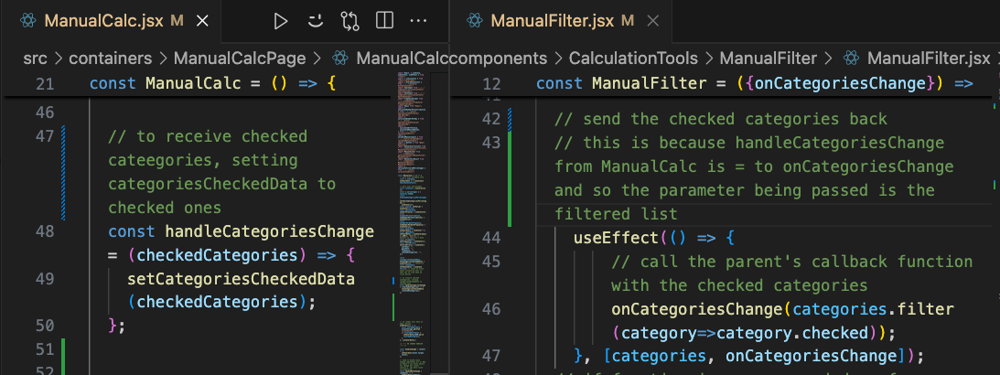

---

# Error Handling

Error handling in this project is primarily focused on validating user inputs and providing feedback to ensure that the data entered is correct and meets the required criteria. 

## Validation Functions
As mentioned in [Validate Utils](#validate-utils), we have the `validateHome`, `validateManualInputs` and `validateSmartInputs` to check user input. 

For consistency, both `validateManualInputs` and `validateSmartInputs`:
- Initialize `isValid` as true and set formErrors to an empty object at the start.
- Retrieve the current points from `userData` to check against the user’s goal.
- Use separate if statements to capture each error independently, so all relevant issues are reported at once.
- Set `isValid` to false whenever a validation rule fails, signaling issues to prevent submission.
- Populate `formErrors` with error messages for each validation issue, which then drives the form's feedback.

**Side Note**: regarding the separate if statements, this approach allows multiple errors to be displayed for a single field. By using a ternary operator, existing errors can be retained. 

The ternary checks if there are existing errors, and if so- new errors are then concatenated to the existing ones, ensuring that all validation checks are represented.

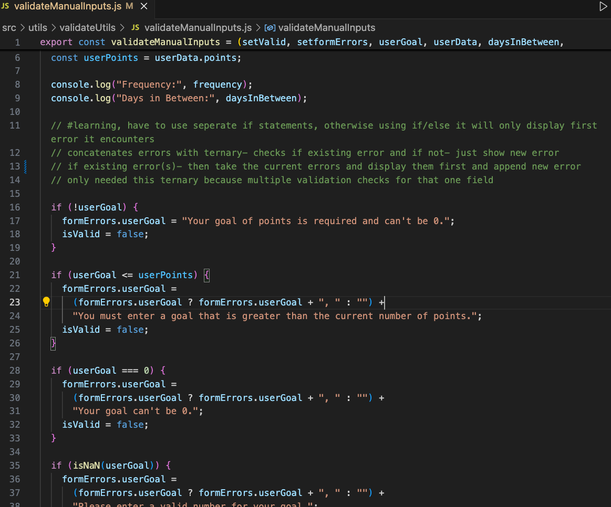

## Error Management/ Feedback

The project utilizes React's state management to keep track of errors. The formErrors state is updated based on validation results, allowing for dynamic feedback to the user.

Here’s a snippet illustrating how error handling is done in the `validateManualInputs` function:

```
if (!userGoal) {
  formErrors.userGoal = "Your goal of points is required and can't be 0.";
  isValid = false;
}
```

When an input doesn’t meet validation criteria, as aforementioned, specific error messages are stored in `formErrors` and displayed, offering clear, actionable guidance. 

```
 {Object.values(formErrors).length > 0 && (
        <div>
          {Object.values(formErrors).map((error, index) => (
            <h4 className="errorContainer" key={index}>
              {" "}
              {error}{" "}
     …
  
```

**Note**: * `Object.values(formErrors)` creates an array of values of errors object [which allows us to also use the array’s `.map` method, and if there are values (errors)- we conditionally render them.

## Input Handling 

The TextField components have helper text that guides users on what is expected, such as "Please enter your current points, without comma."

Further, MUI (Material-UI) ensures valid numeric input. By setting `type="number"`, the `<TextField>` restricts the input to valid numeric characters only.  Also, the browser's built-in number input validation kicks in, which prevents the entry of non-numeric characters, such as commas or letters.

**Note**: However, when we do set the `type = “number”`, it can render as a string, which I noted when calculations returned Naan. As such, I used the following to convert that input to a number:

```
cpnst numericValue = parseInt(value, 10); 
//  10 is the radix for base 10- allows the string numbers to be parsed as numbers
```

In regards to Date Selection,  The `MUI Date Picker` handles date input by only allowing users to select dates that are at least one day ahead of the current date. This is accomplished with the `minDate` prop set to` dayjs().add(1, "day")`.

**Side Note**:
In the case of the MUI Date Picker, you don’t pass the event object as a parameter because the component is designed to provide the selected date value directly.  This is because  the MUI Date Picker handles date changes differently by returning a new date value instead of using the event object as most standard inputs do.

```
const handleDateChange = (newDate) => { setGoalDate(newDate); };
```

## Invalid Submissions

With `onManualCalculate` and `onSmartCalculate`, it will only calculate and display results if the validation functions of `validateManualInputs` or `validateSmartInputs` respectively pass. 

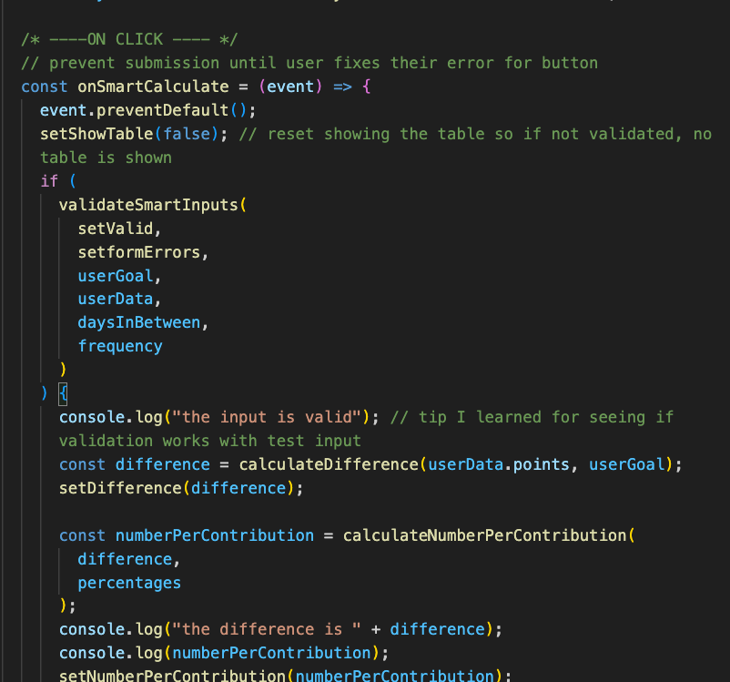

If any validation fails, the submission is halted, and the user is prompted to correct their inputs.

## Invalid Table

We don’t want to show the result table regardless of input validation. I noticed this error when some negative numbers returned in the result table during a test case where the goal points were less than current points, but the table was still rendered. 

To prevent that: 

- `showTable` is initialized as false in its useState, which prevents the table from rendering when the component first loads.

- `onSmartCalculate` and `onManualCalculate` also reset `showTable` to false to ensure that any previously rendered table is hidden before validation occurs. (This was done due to another test case where initial input was valid, so a table rendered. Then, input was adjusted with some invalid numbers and the initial table still showed, which could mislead users).

- Finally if the input validation passes, then `setShowTable` is set to true.
The table is only rendered if `setShowTable` is true. For example: `   {showTable && (<SmartCalcResult…`


---

# What I learned 

## Reference Equality

React works on reference equality. For example, reference equality is used by React to compare the `prevCategories` (the original state) with the new array that is created after `handleCheckboxChange` runs in `ManualFilter`. 

The `handleCheckboxChange` function updates the checked status of a category by iterating through the original `prevCategories` array, which represents the state before any changes.

For each item, it checks if the `item.category` matches the `category` that was checked (aka passed as parameter in `handleCheckboxChange`). 

- If it matches, a new object is created as a shallow copy of the item with the checked status flipped. 
- If it doesn't match, the item remains unchanged. 

By creating a new object for the modified item, React can effectively recognize the changes due to reference equality, triggering a re-render when necessary.
This ensures only the specified category’s checked status is updated, while all other items are preserved as they are.


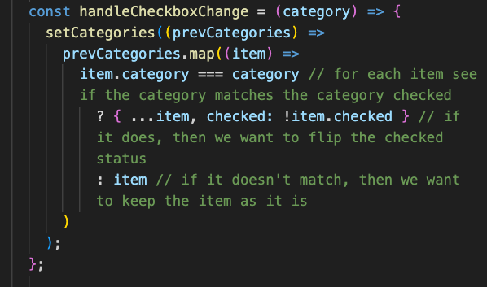

Reference equality is also used in `setFormData` as shown below. You can see how a copy of the current form state is made with `...prevFormData`. This is how React can then compare the current form state `prevFormData` with the copy, and if it detects changes- it re-renders the component to reflect the updated state.

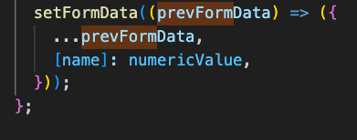

## Infinite Re-renders

I initially encountered an infinite re-render issue when trying to directly set the percentage using `setPercentages` The way I had it at first was calling `setPercentages` directly within the component’s render logic (outside of useEffect or an event handler).

This meant that percentages would be set which would trigger a re-render. Each re-render then called `setPercentages` again, causing another re-render, and so on. This is why it leads to an infinite loop

I resolved this by using `useEffect`, ensuring that the calculation only occurs after userData is available. 

```
useEffect(() => {
   const { percentages, error } = calculateUserPercentage(userData);
   setPercentages(percentages);
   setError(error);
 }, [userData]);
```
The code above to `setPercentages` will trigger a re-render, but the logic within useEffect won’t run again unless userData changes again, thus preventing the infinite loop.

## Dependency Array
If a function is passed down from a parent as a prop, and this function works with data that changes, it’s important to add this function to the `useEffect` dependency array to ensure that any updates from the parent are captured. 

This is particularly crucial if the parent uses the function with data that changes over time. Omitting it could lead to outdated or stale data being used in the effect. 

However, in cases where the function does not depend on changing data from the parent—like in this example—you can safely exclude it without risking issues with stale data.

```
 useEffect(() => {
        // call the parent's callback function with the checked categories
        onCategoriesChange(categories.filter(category=>category.checked));
    }, [categories, onCategoriesChange]);
```

### Page Refreshes
In `SmartCalc` and `ManualCalc`, `setUserData` is included in the useEffect dependency array to ensure reference stability and prevent stale closures, or in other words to ensure we have its latest version. 

According to React's rules of hooks, all values referenced inside the useEffect (i.e. `setUserData`) should be included in the dependency array. This ensures that the effect remains in sync with the latest values and functions.

When the page refreshes, the entire React component tree reloads, including a new instance of `setUserData`. During this refresh, the useEffect hook retrieves user data from local storage, ensuring the effect runs with the latest function reference, and this in short is how we get the data from localStorage on page refreshes. 

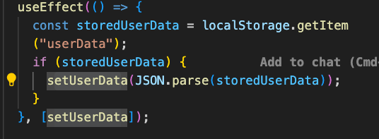

## _redirects

When deploying a React app with React Router on Netlify, I encountered a "page doesn't exist" error on page refresh.  This issue arose because React Router handles routing on the client side, while Netlify's server expects server-side routes. 

To resolve this, we can add a ` _redirects file` in the public directory, adding the line` /* /index.html 200`. This ensures that all routes serve index.html, allowing React Router to manage routing correctly and avoiding 404 errors.

By always serving `index.html`, the server ensures that the client-side React application is loaded for every request. Once the React app is loaded, React Router takes over and reads the current URL route. It then determines which component to render based on that route.

---

# Looking Ahead

In my initial approach, I attempted to use an Axios parser [library](https://github.com/jinwook-k/google-local-guides-api) to scrape user data from Google Maps profiles; library found on [Jinwook's GitHub](https://github.com/jinwook-k).

The idea was to leverage regex to identify and extract specific information, such as the number of reviews, based on English keywords found within the HTML structure. This method would have saved users time by automating data entry. However, I encountered issues with imports and compliance with Google’s scraping policy.

Ultimately, I realized that relying solely on regex was limiting, as it could only parse English content, whereas Google Maps is an international platform. Given this, instead of using the Axios parser, I built a user input box that allows users to manually enter their contribution numbers, which will then be saved to the userData object. This approach not only simplifies the implementation but also makes the tool more inclusive, as it accommodates users from diverse linguistic backgrounds. It’s worth noting that the Google Maps API does not provide any user data endpoints, which further justified this change in strategy.

Looking to the future, I may explore other parsing tools or libraries that can handle a wider range of languages and data formats more effectively. Another idea for down the pipeline  in future iterations could be allowing users to save or export their plans. This would provide users with flexibility and convenience, allowing them to keep a record of their inputs beyond what is visible within the app.
